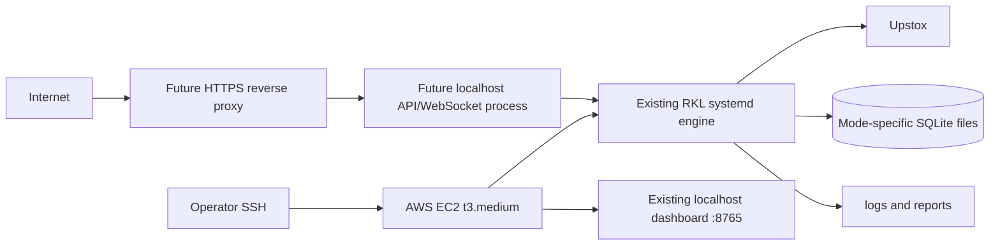
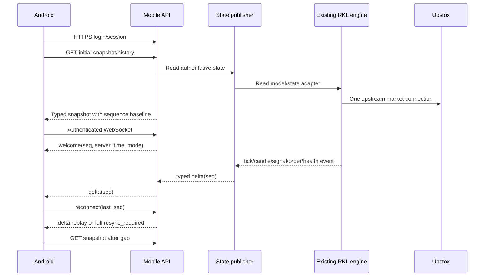

# RKL Mobile + Platform Integration
## Pre-Implementation Audit

**Audit date:** 2026-09-13  
**Scope:** Read-only repository and deployment-template audit  
**Code changes made during audit:** None  
**Production changes made:** None

## 1. Executive decision

The existing RKL engine remains fully enabled and authoritative while the mobile client is developed. The mobile client is read-only; this does not mean production execution is read-only. No production execution setting, systemd service, broker credential, strategy, order path, or production database is changed by the mobile layer.

The recommended architecture is staged:

- **During live production:** observe the existing running engine through the read-only compatibility/API layer; do not disable, freeze, or replace production.
- **First production API slice:** add a separate read-only API/WebSocket process on the same EC2, bound to localhost, behind HTTPS reverse proxy authentication. Do not replace the engine HTTP server and do not change the engine's systemd service.
- **Future multi-client platform:** retain one Upstox connection and one authoritative RKL engine, then distribute typed snapshots and deltas through the API/WebSocket layer. Add external infrastructure only after measurements prove the EC2 is insufficient.

A new EC2, ECS, Kubernetes, RDS, Redis, or ALB is **not justified by the repository evidence currently available**.

## 2. Audit evidence and limits

### Verified in the workspace

- `main.py` is the orchestration process and creates the Upstox adapter, candle engines, signal engines, option state, order manager, position manager, SQLite store, observability, terminal display, and dashboard.
- `config.py` owns execution modes, database selection, credentials, market settings, feed settings, order gates, and dashboard binding.
- `TerminalDisplay.snapshot()` is the current runtime read model consumed by both the terminal and dashboard.
- `web_dashboard.py` is a standard-library `ThreadingHTTPServer`, not FastAPI.
- Existing routes are `/`, `/health`, `/ready`, `/state`, and `/events` using server-sent events.
- The current compatibility layer adds authenticated `/api/mobile/*` read routes using `MOBILE_API_TOKEN`.
- Upstox market data is consumed once by the existing `UpstoxAdapter`; mobile clients do not create Upstox connections.
- SQLite tables and mode metadata are created by `storage/sqlite_store.py`.
- Mode-specific database defaults exist for READ_ONLY, BACKTEST, SANDBOX, and PRODUCTION.
- Existing tests cover the engine, safety boundaries, market data, signals, options, orders, positions, observability, and dashboard health.
- The Flutter source currently exists under `mobile_app/` as a read-only development shell.
- The repository contains systemd and nginx templates under `deployment/digitalocean/`.

### Not verifiable from this workspace

- The live AWS EC2 service status, actual systemd unit installed on AWS, security groups, subnet, route table, TLS certificates, DNS, CPU history, RAM history, disk pressure, and real client count.
- Whether the deployment is currently DigitalOcean or AWS, because the repository deployment templates are named `digitalocean` while the requested environment is AWS EC2.
- End-to-end live broker order behavior from the local test suite.
- A production Flutter APK build because Flutter is not installed in the current environment.

The live AWS state must be checked by an operator after Tuesday, without changing it during this audit.

## 3. Current architecture diagram

```mermaid
flowchart TD
    U[Upstox REST APIs] --> B[broker/upstox.py]
    W[Upstox Market WebSocket] --> B
    B --> T[MarketDataService in main.py]
    T --> C[market_data/candles.py]
    C --> I[market_data/indicators.py]
    T --> S[signals/breakout.py and rsi_filter.py]
    T --> O[instruments/options.py]
    T --> OM[broker/order_manager.py]
    T --> PM[trading/positions.py]
    T --> R[reconciliation and preflight]
    T --> D[TerminalDisplay.snapshot()]
    T --> DB[(SQLite database selected by EXECUTION_MODE)]
    T --> OBS[observability.py and audit JSONL]
    D --> H[web_dashboard.py]
    H --> BROWSER[Local browser dashboard]
    H --> MOBILE[Current authenticated mobile compatibility routes]
```

### Runtime ownership

| Responsibility | Authoritative owner | Verified location |
|---|---|---|
| Upstox authentication and feed | `UpstoxAdapter` / `UpstoxClient` | `broker/upstox.py`, `main.py` |
| Index resolution | Instrument resolver | `instruments/resolver.py`, `config.py` |
| Five-minute candles | `CandleEngine` | `market_data/candles.py` |
| Indicators | CCI, Wilder RSI, RSI SMA helpers | `market_data/indicators.py` |
| Type 1 signals | Breakout engine | `signals/breakout.py` |
| Type 2 signals | Type2 engine | `signals/breakout.py` |
| RSI filter | RSI validation | `signals/rsi_filter.py` |
| Candidate audit | Candidate trace and signal audit | `signals/candidate_trace.py`, `signals/audit.py` |
| Option selection | Official instrument-master contracts and live quote data | `instruments/options.py` |
| Order execution | Gated `OrderExecutor` | `broker/order_manager.py`, `config.py` |
| Position state | Broker-authoritative `PositionManager` | `trading/positions.py` |
| Production safety | Preflight and safety gate | `services/preflight.py`, `trading/safety.py` |
| Persistence | Mode-bound SQLite store | `storage/sqlite_store.py` |
| Runtime read model | Thread-safe display snapshot | `terminal_display.py` |
| Dashboard/mobile presentation | HTTP server over snapshot | `web_dashboard.py` |

## 4. Current AWS resource diagram

The following is the intended/current repository-level arrangement, not a verified diagram of the live AWS account:



### Repository deployment facts

- The systemd template runs as unprivileged user `rkl` with `NoNewPrivileges=true`, `PrivateTmp=true`, `ProtectSystem=full`, and explicit writable paths.
- The systemd template starts `main.py` from a virtual environment and restarts on failure.
- The nginx template proxies HTTPS to `127.0.0.1:8765` and contains basic authentication placeholders.
- Docker overrides `DASHBOARD_HOST=0.0.0.0` and publishes `8765:8765`. This is unsafe for direct public exposure without firewall and proxy controls.
- The repository does not prove that the systemd template is the actual installed production unit.

## 5. Exact current data flow

1. `main.py` constructs `MarketDataService`.
2. `CandleStore` opens the database selected from `EXECUTION_MODE` and records runtime mode metadata.
3. `UpstoxAdapter` authenticates using backend environment configuration.
4. The adapter receives one upstream market feed and normalizes ticks.
5. `_on_tick()` updates `FeedHealth`, the `TerminalDisplay`, candle engine, option quotes, and signal evaluation.
6. `CandleEngine` creates and finalizes five-minute candles using exchange timestamps.
7. Completed candles feed indicators and signal engines.
8. Signal candidates are traced, audited, queued, option-resolved, and passed through existing safety/order logic.
9. Orders and positions use broker-authoritative APIs and reconciliation.
10. The same runtime writes SQLite, telemetry, daily reports, JSONL audit files, and the in-memory display snapshot.
11. The existing dashboard and current mobile compatibility API serialize state from the display snapshot and selected SQLite report data.
12. Flutter consumes only the API. It must never open an Upstox connection or reproduce calculations.

## 6. Current endpoints and required endpoints

### Existing endpoints

| Endpoint | Current behavior | Security state |
|---|---|---|
| `/` | HTML read-only dashboard | Local/trusted deployment assumption |
| `/health` | Liveness/component response | Unauthenticated |
| `/ready` | Readiness response, 200 or 503 | Unauthenticated |
| `/state` | Full runtime snapshot | Unauthenticated local route |
| `/events` | SSE loop sending a full snapshot every 0.5 seconds | Unauthenticated local route |

### Current mobile compatibility endpoints

| Endpoint | Current payload source | State |
|---|---|---|
| `/api/mobile/status` | Snapshot status fields | Implemented, development-only |
| `/api/mobile/market` | Snapshot ticks, candles, health, sync | Implemented, development-only |
| `/api/mobile/indices` | Same market snapshot subset | Implemented, development-only |
| `/api/mobile/options` | Option universe, quotes, active signal | Partial |
| `/api/mobile/signals` | Active signal, history, queue | Partial |
| `/api/mobile/orders` | Display order list | Partial |
| `/api/mobile/positions` | Display positions and details | Partial |
| `/api/mobile/notifications` | Display event list | Partial |
| `/api/mobile/reports` | SQLite daily reports | Partial |
| `/api/mobile/sandbox` | Mode marker and empty results list | Scaffold only |

### Required production API

The API should be versioned, typed, and separated from the local dashboard routes:

```text
GET  /api/v1/mobile/status
GET  /api/v1/mobile/market
GET  /api/v1/mobile/indices/{index}
GET  /api/v1/mobile/indicators/{index}
GET  /api/v1/mobile/options/{index}
GET  /api/v1/mobile/signals
GET  /api/v1/mobile/signals/{signal_id}
GET  /api/v1/mobile/notifications
GET  /api/v1/mobile/orders
GET  /api/v1/mobile/orders/{order_id}
GET  /api/v1/mobile/positions
GET  /api/v1/mobile/positions/{trade_id}
GET  /api/v1/mobile/reports
GET  /api/v1/mobile/reports/{date}
GET  /api/v1/mobile/sandbox
WS   /api/v1/mobile/stream
```

The production API should expose typed backend serializers, not raw dashboard dictionaries or raw broker responses.

## 7. Screen-to-backend data map

| Screen | Data | Current source | Existing API | Missing API | Database source | Real-time source | Required implementation |
|---|---|---|---|---|---|---|---|
| Control Centre | RKL, AWS reachability, feed, DB, history, signal/order state, mode, heartbeat | `TerminalDisplay.snapshot()`, preflight, service heartbeat | `/api/mobile/status` | Typed status and reachability contract | `runtime_metadata`, telemetry | Engine snapshot; future API stream | Add server time, heartbeat age, explicit AWS/API unavailable states |
| Market | LTP, change, OHLC, current/previous candle, timeframe, timestamps | `TerminalDisplay.latest/candles/previous/prev2` | `/api/mobile/market` | Per-index typed query and change field | `raw_market_events`, `candles` | Upstox feed through engine | Serialize exchange and receipt timestamps without client calculation |
| Index Data | Four indexes and comparison data | Same display state and instrument resolver | `/api/mobile/indices` | `/indices/{index}`, historical query | `candles`, `raw_market_events` | Engine snapshot stream | Add index-specific schema and time range query |
| Indicators | CCI5, RSI14, RSI SMA5, future SMA10/20/30/50 | Indicator engine and display tuple | Indirectly in `/state`; not mobile typed | `/indicators/{index}` | Candle data plus persisted signal payloads | Candle-close event | Add extensible named indicator map with timestamp and readiness reason |
| Options | ATM, expiry, strike, CE/PE, token, LTP, OHLC, liquidity, active option | `instruments/options.py`, display option universe/quotes | `/api/mobile/options` | Full selected-option detail | Instrument master, raw option events, signal/order/position payloads | Option quote feed through engine | Add backend-selected contract DTO; never select in Flutter |
| Signals | Type, direction, accepted/rejected, filters, candidate status | Breakout/Type2, RSI filter, coordinator, audit/trace | `/api/mobile/signals` | Signal list/detail with conditions and rejection reason | `signals`, `signal_events`, JSONL audits/traces | Signal events from engine | Add signal type registry and full evaluation DTO for Signal 3+ |
| Notifications | Signal/order/fill/exit/SL/error/warning/system/feed/recovery | Display events and observability | `/api/mobile/notifications` | Filtered paginated telemetry API | `telemetry_events`, system/order/position events | Observability event bus | Map categories and severity; add cursors and retention policy |
| Orders | ID, time, index, instrument, strike, side, quantity, type, price, status, broker response | Order manager, broker adapter, display order list | `/api/mobile/orders` | Order detail/history/trades endpoint | `orders`, `order_requests`, `fills`, `stop_orders` | Portfolio stream/reconciliation | Serialize normalized broker-authoritative lifecycle; redact sensitive raw fields |
| Positions | Instrument, qty, broker entry, LTP, P&L, SL, risk, R:R, state, exit | PositionManager and broker reconciliation | `/api/mobile/positions` | Position detail and P&L endpoint | `positions`, `fills`, `exits`, `position_events` | Portfolio stream/reconciliation and quote feed | Only expose confirmed fills and broker positions; no fabricated values |
| Sandbox | Date/index/strategy/signal/side, trades, fills, exits, SL, P&L, win/loss | Mode-specific engine/database | Marker only `/api/mobile/sandbox` | Filtered sandbox query/report API | `data/sandbox.sqlite3` | Sandbox engine events | Separate DB connection and authorization scope; never fallback to production |
| Reports | Date, signal stats, errors, orders, latency, health, sandbox metrics | `Observability.daily_report()` | `/api/mobile/reports` | List/detail/date/filter endpoints | `daily_reports`, `telemetry_events` | Report generation event, not tick stream | Add pagination and report schema version |
| System Health | API, WS, feed, DB, history, candle, signal, order, service, heartbeat, critical events | Display components, preflight, telemetry, systemd outside app | `/health`, `/ready`, status | Authenticated health DTO and service-agent status | Telemetry and runtime metadata | Heartbeat/status stream | Keep infrastructure health separate from strategy state |
| Settings | Session, device, API environment, theme, notification settings | None | None | Auth/session/device/preferences APIs | Future auth/audit/preferences DB | Login/session events | Do not expose `.env` or broker settings |
| Future Controls | Start/stop/restart with confirmation and roles | systemd outside current API | None | Dedicated command API | Audit/control command store | Command accepted/completed events | Server-side control service only; never SSH/systemd from Flutter |

## 8. REST versus WebSocket design

### Required flow



### WebSocket contract

Every message should contain:

```json
{
  "protocol": "rkl.mobile.v1",
  "sequence": 12345,
  "event_id": "uuid",
  "event_type": "MARKET_TICK",
  "server_time": "2026-09-13T09:15:00+05:30",
  "source_timestamp": "2026-09-13T09:14:59+05:30",
  "payload": {}
}
```

Required behavior:

- Authenticate before accepting the stream.
- Send a heartbeat/ping at a bounded interval.
- Include monotonic sequence numbers.
- Use bounded replay storage or declare `resync_required` when a gap cannot be replayed.
- Reconnect with exponential backoff and jitter.
- Mark UI state stale after an explicit timeout.
- Fetch a full REST snapshot after reconnect or sequence gap.
- Represent market closed as a valid state, not as a feed failure.
- Represent AWS/API unreachable separately from Upstox feed disconnected.
- Do not create one Upstox market connection per Android client.
- Prefer state deltas over the current `/events` full-snapshot SSE loop.

The existing `/events` route is not sufficient as the production mobile transport because it is unauthenticated, sends full snapshots every 0.5 seconds, has no sequence number, and has no replay/gap protocol.

## 9. Architecture choice

### Option A: Add mobile routes to existing dashboard process

**Pros:** smallest change, no extra process, low RAM, reuses snapshot directly.  
**Cons:** couples public mobile security and traffic to the local dashboard; current server has no typed API framework, role system, WebSocket protocol, or request controls.

**Decision:** acceptable for the current live read-only compatibility layer and integration validation. Not the final public architecture.

### Option B: Separate API process on the same EC2

**Pros:** isolates client traffic from engine/dashboard, allows FastAPI/ASGI and authenticated WebSocket, can remain localhost-bound, shares a read-only state adapter, no second EC2.  
**Cons:** requires a safe state bridge and a second systemd unit after the observation window.

**Decision:** recommended first production architecture after Tuesday.

### Option C: Replace existing HTTP layer with FastAPI

**Pros:** one API technology.  
**Cons:** unnecessary migration risk, changes stable dashboard behavior, broadens the pre-Tuesday blast radius.

**Decision:** rejected for now.

### Option D: Separate EC2 or distributed infrastructure

**Decision:** not currently justified. Revisit only after measured CPU, memory, network, connection count, availability, or security requirements exceed one host.

## 10. AWS t3.medium capacity assessment

### Assumptions

These are engineering estimates, not measurements of the live host. They assume the engine is already running normally, typed deltas are used, and the API does not duplicate market-data processing.

| Scenario | Additional RAM | Additional CPU | Network estimate | WebSocket load | Assessment |
|---|---:|---:|---:|---:|---|
| Android only | 30-80 MB | <1-3% average | 0.01-0.10 Mbps | 1 client | Easily fits if engine has headroom |
| Android + browser | 40-120 MB | 1-5% average | 0.02-0.20 Mbps | 2 clients | Fits on t3.medium under normal load |
| 5-20 simultaneous clients | 80-250 MB | 3-12% average | 0.10-1.50 Mbps | 5-20 clients | Likely fits; measure during market open |
| 20-50 future clients | 200-500 MB | 8-25% average | 0.50-4.00 Mbps | 20-50 clients | Probably fits only with bounded deltas and connection limits; measure |
| Larger multi-client platform | 500 MB+ | 25%+ and burst-sensitive | Multi-Mbps | 50+ clients | Consider separate API host/cache only after evidence |

Initial REST snapshot cost is likely tens to hundreds of KB per client depending on history. A delta stream should be kept small. The existing full-snapshot SSE behavior can be much more expensive: a 5-50 KB snapshot every 0.5 seconds is approximately 0.8-8.0 GB/day per continuously connected client before protocol overhead. Do not use that pattern for public scale.

### Recommendation for t3.medium

- Keep the existing engine on the t3.medium.
- Add the first API/WebSocket process on the same host after Tuesday.
- Set connection, request, message-size, and history-retention limits.
- Measure `CPUUtilization`, memory, load average, process RSS, network bytes, SQLite latency, and WebSocket send queue during market open.
- Do not add another AWS resource until sustained measurements show a problem.

## 11. Security architecture

### Current security boundary

- Broker credentials are backend environment variables.
- Mobile routes require a shared `MOBILE_API_TOKEN`.
- The client has no broker, AWS, SSH, or `.env` access.
- The dashboard defaults to localhost in ordinary configuration.
- Execution mode and order gates remain backend-controlled.

### Current development-only weaknesses

- The bearer token is static and shared.
- There is no login, refresh token, revocation, device registration, role authorization, biometric unlock, or session expiry.
- `/state`, `/events`, `/health`, and `/ready` are unauthenticated routes in the existing server.
- Docker publishes port 8765 and binds to `0.0.0.0`.
- There is no production API rate limiting, structured request audit middleware, or typed response redaction layer.
- The current mobile payloads are dashboard-shaped and may contain more operational detail than a public client should receive.

### Required production controls

1. Keep the engine and dashboard on private localhost bindings.
2. Put HTTPS termination in nginx or an AWS-managed HTTPS edge only after the post-Tuesday change window.
3. Use short-lived access tokens and rotating refresh tokens.
4. Register devices, support revocation, and expire sessions.
5. Enforce admin, operator, read-only client, and sandbox client roles server-side.
6. Use separate authorization scopes for production, sandbox, reports, and future controls.
7. Store secrets only in protected AWS secret/environment storage; never in Flutter source or APK assets.
8. Add audit events for login, device registration, token revocation, report access, sandbox access, and control commands.
9. Apply rate limits, body/response-size limits, origin policy, security headers, and connection limits.
10. Redact broker raw responses and infrastructure details from client payloads.
11. Require explicit confirmation, idempotency, and server-side safety checks for any future start/stop/restart operation.
12. Never implement SSH, root, systemd, AWS, Upstox, or broker credentials in Android.

## 12. Sandbox and production isolation

Current default paths are:

```text
data/readonly.sqlite3
data/backtest.sqlite3
data/sandbox.sqlite3
data/production.sqlite3
```

`CandleStore` records an `execution_mode` in `runtime_metadata` and rejects a mode mismatch when opening a database. `config.validate_runtime()` also prevents unsafe combinations such as real orders in READ_ONLY/BACKTEST and live order environment in SANDBOX.

### Required sandbox design

- Open `data/sandbox.sqlite3` through a dedicated sandbox repository/connection.
- Enforce the requested user/session scope before query execution.
- Never accept a client-supplied database path.
- Never fallback from sandbox to production when a table is empty.
- Return a visible `NO_SANDBOX_DATA` state rather than production data.
- Keep sandbox access read-only for demo clients.
- Include date/index/strategy/signal/side/result filters as parameterized SQL.
- Add tests that seed distinct production and sandbox records and prove no cross-read.
- Do not expose production credentials to sandbox or demo APKs.

## 13. Flutter project structure

The current development shell is too small for the final client. Recommended future structure:

```text
mobile_app/
  pubspec.yaml
  lib/
    main.dart
    app/
      app.dart
      router.dart
      theme/
    core/
      auth/
      networking/
      websocket/
      models/
      error/
    features/
      control_centre/
      market/
      index_data/
      indicators/
      options/
      signals/
      notifications/
      orders/
      positions/
      sandbox/
      reports/
      system_health/
      settings/
    widgets/
  test/
  integration_test/
  android/
```

Flutter should deserialize backend DTOs and render states. It should not contain signal formulas, option ranking, broker status inference, P&L computation, execution-mode constants, or database access.

## 14. Development phases

### Phase 0: Live-safe implementation

- Leave production execution fully enabled under its existing configuration.
- Build only read-only API and Flutter changes around the authoritative state.
- Do not expose port 8765 directly; use the configured private/reverse-proxy path when deployed.
- Do not change systemd, broker credentials, strategy, order behavior, or production database.
- Validate against the actual running RKL state without replacing it with fixtures or dummy production data.

### Phase 1: Post-Tuesday contract

- Define versioned OpenAPI and WebSocket schemas.
- Add typed backend serializers over the authoritative state.
- Add API contract tests and redaction tests.
- Add per-screen read-only endpoints.

### Phase 2: Same-EC2 API gateway

- Implement a separate localhost-bound API/WebSocket process.
- Add a dedicated systemd unit only after approval and testing.
- Put nginx/TLS in front of the API, not the raw dashboard port.
- Add bounded delta publishing and reconnect/resync behavior.

### Phase 3: Authentication and authorization

- Login, refresh, revocation, device registration, session expiry, biometric unlock support.
- Admin/operator/read-only/sandbox roles.
- Audit trail and security monitoring.

### Phase 4: Flutter production client

- Implement all requested screens and typed state handling.
- Add offline, stale, backend unavailable, feed disconnected, market closed, and reconnect states.
- Add widget and integration tests.

### Phase 5: Controlled distribution

- Build signed APK/AAB.
- Use Play internal/closed testing first.
- Use separate client-scoped sessions, not a master token in the APK.
- Promote only after security and production-readiness review.

## 15. Exact files that would need modification later

These are candidates, not instructions to modify now:

### Backend/API

- New `api/` or `mobile_api/` package for typed REST/WebSocket DTOs and auth.
- New API entrypoint and dependency declarations.
- `terminal_display.py` only if a formal read-model/event publisher is introduced; avoid changing calculation logic.
- `storage/sqlite_store.py` for parameterized, mode-aware read repositories.
- `observability.py` for API/auth/control audit events.
- `config.py` for API bind address, TLS/proxy trust, session settings, and limits.
- New tests under `tests/test_mobile_api_*.py`, `tests/test_mobile_auth_*.py`, and sandbox isolation tests.
- New deployment templates for a separate API service and reverse proxy location, only post-Tuesday.

### Flutter

- `mobile_app/pubspec.yaml`
- `mobile_app/lib/main.dart` during decomposition
- New `mobile_app/lib/app`, `core`, `features`, `test`, and `integration_test` files
- Android signing/build configuration, never secrets

## 16. Files that must not be modified for mobile UI work

Until a separately approved production-engine change is required, do not modify:

- `broker/upstox.py`
- `broker/order_manager.py`
- `signals/breakout.py`
- `signals/rsi_filter.py`
- `signals/coordinator.py`
- `instruments/options.py`
- `market_data/candles.py`
- `market_data/indicators.py`
- `trading/positions.py`
- `trading/safety.py`
- `trading/stop_loss_policy.py`
- the live production SQLite database
- the installed systemd unit
- broker credentials and order configuration
- Upstox connection logic

`main.py` should also remain unchanged for the initial mobile phase except for an explicitly reviewed process integration after Tuesday.

## 17. Test plan

### Existing baseline

- Run `python -m compileall -q .`.
- Run `python -m pytest -q`.
- Run dashboard health/readiness tests.
- Run execution-mode and production-boundary tests.

### API

- Contract tests for all status, market, index, indicator, option, signal, event, order, position, report, and sandbox DTOs.
- Missing/invalid/expired/revoked token tests.
- Role matrix tests.
- Pagination, date, index, strategy, and result filtering tests.
- Redaction tests proving broker and infrastructure secrets never leave the backend.

### Realtime

- Initial REST snapshot followed by WebSocket welcome.
- Monotonic sequence numbers.
- Heartbeat timeout.
- Reconnect with backoff.
- Replay within retention window.
- Full resync after a sequence gap.
- Feed disconnected versus API unavailable versus market closed.
- Backend restart while Android is connected.

### Isolation and safety

- Sandbox cannot read production.
- READ_ONLY cannot submit orders.
- Mobile endpoints cannot mutate trading state.
- Closing Android does not stop RKL.
- No Flutter calculation changes execution results.
- Existing full engine suite remains green.

### Android

- Flutter analyzer.
- Unit tests for JSON models and state reducers.
- Widget tests for loading, stale, unavailable, closed, and error states.
- Integration tests for authentication, reconnect, session expiry, and navigation.
- Signed release APK/AAB build.
- Internal Play testing before wider distribution.

## 18. Deployment and domain plan

Do not configure DNS or purchase/configure `rklalgo.com` during this audit.

Future flow:

```text
rklalgo.com
    -> HTTPS 443
    -> reverse proxy/load balancer
    -> localhost API/WebSocket process on same EC2
    -> read-only state adapter
    -> existing RKL engine state
```

Minimum AWS networking for the first secure deployment:

- Public DNS record to an HTTPS endpoint.
- TCP 443 permitted to the HTTPS edge.
- Port 8765 denied from the public Internet.
- SSH restricted to an operator IP or private access path.
- Engine/API/dashboard bound to localhost or a private interface.
- TLS certificate and automatic renewal.
- Outbound HTTPS permitted to Upstox and required services.
- Security-group and host-firewall logging.

Do not introduce an ALB unless the chosen HTTPS architecture requires it. A single EC2 nginx reverse proxy with a managed certificate is sufficient for the first low-volume client deployment, subject to the organization's AWS security policy.

## 19. APK distribution plan

1. Development: local emulator/device against a private read-only endpoint.
2. Internal: signed APK or Google Play Internal Testing.
3. Closed client pilot: Play Closed Testing with sandbox/read-only role.
4. Production: signed AAB through Play production only after HTTPS, authentication, authorization, audit, reconnect, and isolation acceptance.
5. Never put a backend master token, Upstox token, client secret, AWS credential, SSH credential, or `.env` value in the APK.

## 20. Risks

| Risk | Impact | Mitigation |
|---|---|---|
| Public mobile traffic shares dashboard process | Engine availability and security risk | Separate API process after Tuesday |
| Full-snapshot SSE fanout | Network/CPU growth | Typed deltas and sequence/resync protocol |
| Static bearer token | Credential sharing and no revocation | Short-lived sessions and device registration |
| Dashboard `/state` exposure | Operational/sensitive data leakage | Keep localhost; typed redacted DTOs |
| Docker `0.0.0.0:8765` | Direct public attack surface | Private binding/firewall/proxy |
| Raw broker payload exposure | Sensitive or unstable contract | Normalize and redact backend DTOs |
| Snapshot is display-oriented | Missing fields and stringly typed data | Dedicated read model/serializers |
| SQLite concurrent readers | Latency/locking under growth | Read-only connection strategy and measurement |
| Sandbox fallback bug | Production data disclosure | Explicit database scope and isolation tests |
| Public deployment without measurement | Live trading instability | Keep the mobile listener read-only, private, bounded, and measured before wider exposure |
| Unverified live AWS state | Incorrect operational assumptions | Operator evidence collection post-Tuesday |

## 21. What can be done now

- Keep this audit and architecture decision as documentation.
- Build Flutter UI against local fixtures.
- Define typed API and WebSocket schemas without deploying them.
- Add contract test fixtures that do not import or alter production execution paths.
- Measure the current engine locally and prepare AWS metrics commands for post-Tuesday review.
- Review the existing Docker exposure and nginx/systemd templates without applying them.

## 22. What should wait for controlled public deployment

- Public Internet exposure of the API or WebSocket.
- Separate API process/systemd unit if the same-process compatibility layer is replaced.
- Authentication/session migration to production roles.
- New systemd unit.
- Nginx/TLS/DNS production changes.
- API database read repositories or migrations.
- Flutter connection to live AWS.
- APK distribution outside local development.
- Any control function or production-changing endpoint.

## 23. Additional AWS resource decision

**Current answer: no additional AWS resource is required.**

A t3.medium should be sufficient for the existing engine plus one low-volume read-only API/WebSocket process if the implementation uses typed deltas, bounded connections, and no duplicate Upstox feed. This is an estimate, not a guarantee. Collect measurements during market open before deciding.

An additional resource becomes justified only if one or more of these are demonstrated:

- sustained memory pressure or swap;
- sustained CPU saturation or t3 CPU-credit depletion;
- SQLite contention that cannot be solved with read-only adapters and bounded queries;
- client count or WebSocket fanout beyond the host's measured capacity;
- high-availability requirements that one EC2 cannot satisfy;
- a security boundary requiring the public API to be isolated from the trading host.

## 24. Recommended minimum and future architectures

### Minimum architecture

```text
Flutter Android
   -> HTTPS + authenticated WebSocket
   -> nginx/TLS on same EC2
   -> separate localhost API process
   -> read-only state adapter
   -> existing RKL engine/systemd
   -> Upstox
```

One Upstox feed, one trading engine, one set of authoritative calculations, one mode-specific database per engine instance.

### Future multi-client architecture

```text
Flutter / web / client integrations
        -> HTTPS edge and authenticated WebSocket gateway
        -> session, role, rate-limit, audit layer
        -> typed state/event publisher with bounded replay
        -> read-only engine adapter
        -> existing RKL engine
        -> Upstox

Sandbox clients -> isolated sandbox read repository -> data/sandbox.sqlite3
Production clients -> scoped production read repository -> production state only
Control requests -> separate authorized control service -> systemd, never SSH from client
```

Add Redis, a queue, a second EC2, an ALB, or a separate database only when measured scale, availability, or security requirements demand it.

## 25. Final audit conclusion

The RKL production engine already contains the authoritative trading behavior required by the future client. The correct mobile project is an adapter and presentation project, not a trading-engine rewrite. The current compatibility routes prove local feasibility but are not a production API architecture.

The mobile client is implemented as a read-only observer over the existing authoritative runtime. Production remains fully enabled; the client does not submit or alter orders, positions, strategy, credentials, systemd, or execution configuration. Public exposure, production-grade sessions, and a separate API process remain controlled deployment steps requiring measurement and security validation.
